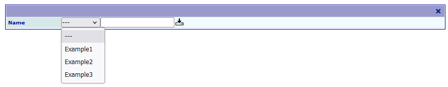
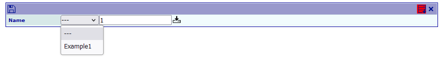

.. include:: ../../Includes.txt

.. _addingFilterToExportSelector:

======================================
Adding a Filter to the Export Selector
======================================

When there are many export configurations associated to an extension in the same page,
it can be useful to apply a filter in order to limit the number of entries in
the selector.

The following TypoScript configuration will add an input field which will be used
in a LIKE statement for the query creating the selector options:

::

   plugin.tx_yourExtensionNameWithoutUnderscores.showFilterInExport = 1

Fill the filter field and click on the load button to restrict 
the selector content.

