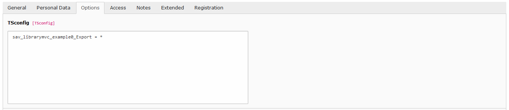
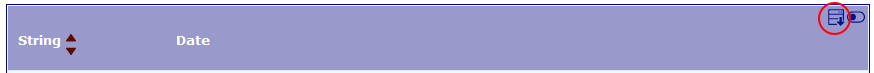
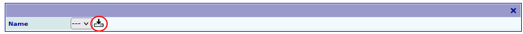
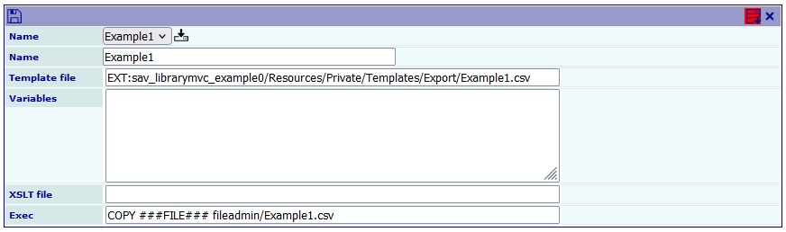
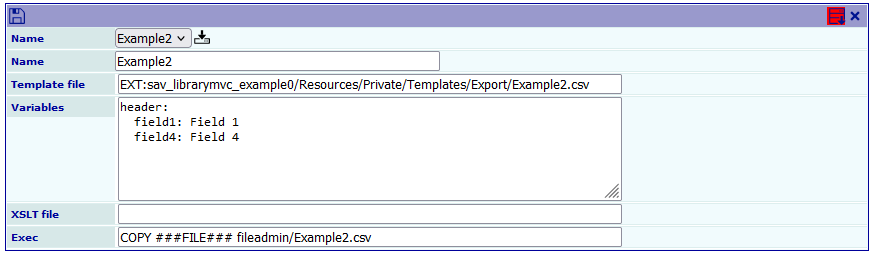
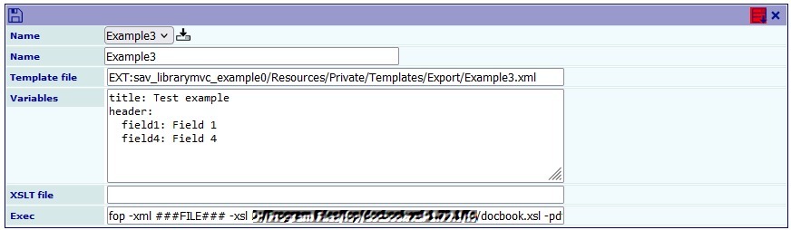
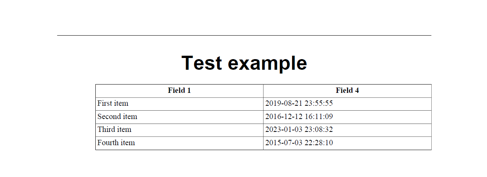

.. include:: ../Includes.txt

.. _exportingData:

==============
Exporting Data
==============

A flexible feature to export data is available in SAV Library Mvc.

Rights for exporting data
=========================

Exporting data is user and extension oriented, therefore rights must be given at the 
user level for one or several extensions.

For example, to give the rights to a given user to export data from the test extension 
`sav_librarymvc_example0 <https://extensions.typo3.org/extension/sav_librarymvc_example0>`_, 
edit the ``Options`` folder of this user configuration and add the following line.

::

    sav_librarymvc_example0_Export = *

Once the rights are set, a new icon is shown in the title bar of the
``List`` view.

Configuration
=============

Click on the previous icon to enter in the export form.
Select the configuration and click on the 
``Load export configuration`` icon. 

.. note::
    
    Just click on the icon to create a new configuration.

The extension `sav_librarymvc_example0 
<https://extensions.typo3.org/extension/sav_librarymvc_example0>`_
provides several templates to illustrate the export feature.
The templates are in the directory ``Resources/Private/Templates/Export``.

 

The template ``Example1.csv`` exports the fields ``field1`` and the 
date provided by ``field4`` in the CSV format. During the
export process, ``###FILE###`` represents the temporary file. The 
``Exec`` field is used to copy the tempory file to 
``fileadmin/Example1.csv``.

Writing templates
=================

Templates are parsed by Fluid. They may contain all
conventional Fluid ViewHelpers. Special ViewHelpers
are provided to remove empty lines and to execute queries.
The template ``Example1.csv`` is shown below.

::

    <sav:removeEmptyLines>

    <sav:query name="items">
    SELECT 
        field1, 
        FROM_UNIXTIME(field4) AS field4
    FROM 
        tx_savlibrarymvcexample0_domain_model_table1
    WHERE 
        NOT deleted
        AND NOT hidden
    </sav:query>
    
    <f:for each="{items}" as="item">
    "{item.field1}";"{item.field4}"
    </f:for>
    
    </sav:removeEmptyLines>
    
Using variables
===============

Variables expressed in Yaml can be passed to templates. 

 
In this example, using the template ``Example2.csv``, the
variable ``header`` is defined and used to generate headers for
the columns.

:: 

    <sav:removeEmptyLines>
    
    <sav:query name="items">
    SELECT 
        field1, 
        FROM_UNIXTIME(field4) AS field4
    FROM 
        tx_savlibrarymvcexample0_domain_model_table1
    WHERE 
        NOT deleted
        AND NOT hidden
    </sav:query>
    
    "{header.field1}";"{header.field4}"
    <f:for each="{items}" as="item">
    "{item.field1}";"{item.field4}"
    </f:for>
    
    </sav:removeEmptyLines> 
    
More Complex Exec Commands
==========================

.. important::

    The use of exec command must be allowed in the ``Advanced``
    folder of the ``Plugin Options`` of the extension, i.e.
    `sav_librarymvc_example0 
    <https://extensions.typo3.org/extension/sav_librarymvc_example0>`_
    in our example.
    
    .. figure:: ../Images/ExportingDataAllowExecInBackend.png
    

Let us illustrate this feature with the generation of a 
DocBook article containing the same information as the
CSV files in the previous examples.

.. note::

    If your are not familiar with DocBook, please read `https://www.oasis-
    open.org/docbook/documentation/reference/html/docbook.html <https://www
    .oasis-open.org/docbook/documentation/reference/html/docbook.html>`_
    and `http://www.sagehill.net/docbookxsl/
    <http://www.sagehill.net/docbookxsl/>`_ . The former is the DocBook
    definitive guide and the later the DocBook XSL complete guide.

The template ``Example3.xml`` is now a XML file containing
DocBook tags. The variables ``title`` and ``header`` are respectively
used to set the title of the article and the headers for the
DocBook table columns. 

The field ``XSLT file`` may use to process the XML temporary file
generated by the Fluid template parser.

::

    <?xml version="1.0" encoding="UTF-8"?>
    <!DOCTYPE article
      PUBLIC "-//OASIS//DTD DocBook XML V4.5//EN" "https://www.oasis-open.org/docbook/xml/4.5/docbookx.dtd">
    <sav:removeEmptyLines>
    
    <sav:query name="items">
    SELECT 
        field1, 
        FROM_UNIXTIME(field4) AS field4
    FROM 
        tx_savlibrarymvcexample0_domain_model_table1
    WHERE 
        NOT deleted
        AND NOT hidden
    </sav:query>
    
    <article lang="en">
      <title>{title}</title>
      <informaltable>
        <tgroup cols="2" align="left" colsep="1" rowsep="1">
          <thead>
            <row>
              <entry align="center">{header.field1}</entry>
              <entry align="center">{header.field4}</entry>
            </row>
          </thead>
          <tbody>
            <f:for each="{items}" as="item">
            <row>
              <entry>{item.field1}</entry>
              <entry>{item.field4}</entry>
            </row>
            </f:for>
          </tbody>
        </tgroup>
      </informaltable>
    </article>
    </sav:removeEmptyLines> 
    
The ``Exec`` field contains the command to generate the PDF
file using the FOP DocBook processor (`https://xmlgraphics.apache.org/fop/
<https://xmlgraphics.apache.org/fop/>`_). In the following command, 
replace ``Path_to_the_fo_directory_of_the_fop_processor``
by the path to the ``fo`` directory of the FOP processor. The marker 
``###SITEPATH###`` is replaced by the public path.

.. code-block:: bat

   fop -xml ###FILE### -xsl Path_to_the_fo_directory_of_the_fop_processor/docbook.xsl -pdf ###SITEPATH###/fileadmin/test.pdf
   
The result is the PDF file ``test.pdf`` in the ``fileadmin`` directory.

    